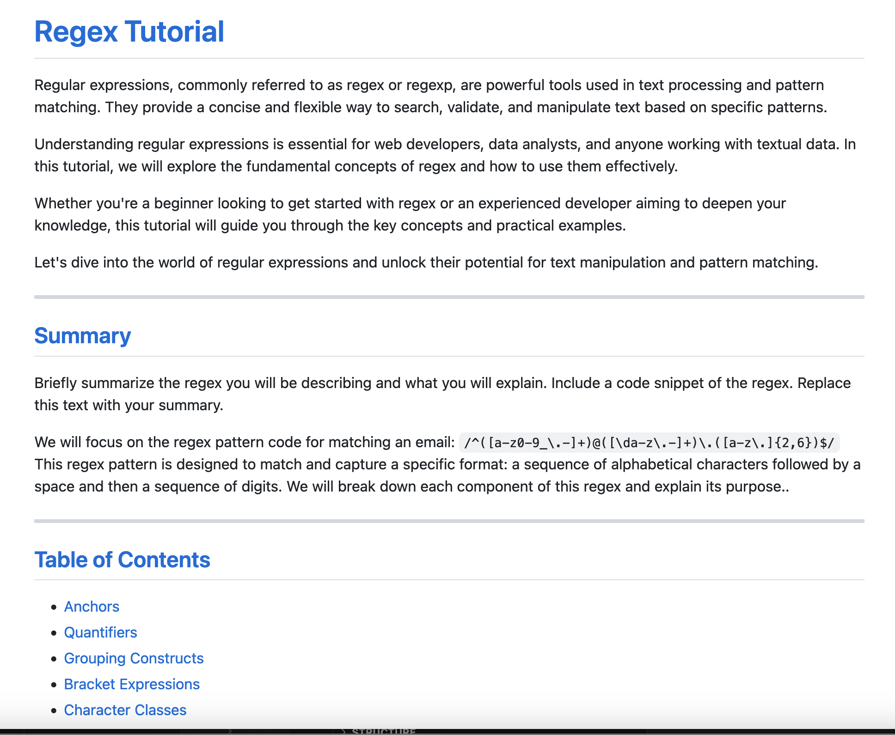

# Regex Tutorial

 ****
 
## Description
***

This assignment is to create a tutorial that explains how a specific regular expression, or regex, functions by breaking down each part of the expression and describing what it does. 
Regular expressions, commonly referred to as regex or regexp, are powerful tools used in text processing and pattern matching. They provide a concise and flexible way to search, validate, and manipulate text based on specific patterns.
Understanding regular expressions is essential for web developers, data analysts, and anyone working with textual data. In this tutorial, we will explore the fundamental concepts of regex and how to use them effectively.

## Table of Contents
*** 
- [Installation](#installation)
- [Usage](#usage)  
- [Contributing](#contributing) 
- [Contact](#contact)
- [License](#license)

##Installation
***

The installation can be completed by following these instructions:

1. Creation a GitHub gist page
2. Add to your gist a`.md` file extension so that your Markdown renders correctly. 

## Usage 
***
Github gist Regex tutorial

 

 https://github.com/bchamidou/Regex_tutorial

## Contributing
***

I  utilized several coding website for help, including STackOverflow, w#schools.com, …. I also watched YouTube video tutorials and the course resources.

Any developers who are interested in contributing ideas for this application must agree to follow and comply with the Contributor Covetnant: Code of Conduct.
The Contributor Covenant Code of Conduct can be found in the following address:
 
 
## Contats
***

For additional questions, please contact by email: bchamidou@gmail.com.
or my Github page:(https://github.com/bchamidou@gmail.com)

## License
***

This application is covered under the MIT License.

Copyright (c) 2023 Bchamidou.

This software/code is licensed under the MIT License; 
to use this software/code you must agree to follow and comply the License.
A copy of the License can be found at: https://www.gnu.org/licenses/gpl-3.0.md 

***
## Author

Cheik H BAGAGNAN
GitHub profile 
https://github.com/https://github.com/bchamidou